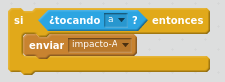
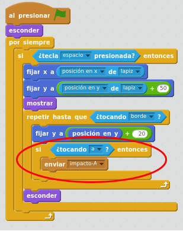
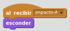
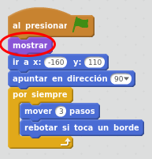
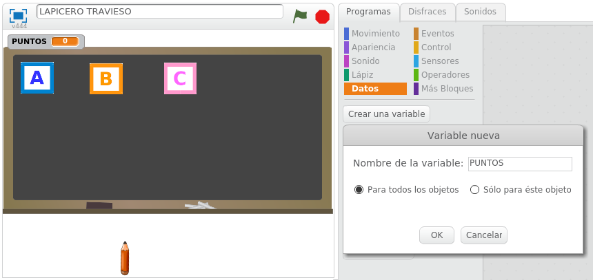
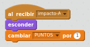

# Colisión del disparo con un objeto

## Caso práctico: control de la colisión del disparo con una letra

La colisión la vamos a controlar dentro del movimiento del disparo, por lo que continuaremos añadiendo más programación al objeto de disparo. También necesitaremos añadir más programación en las letras. El objetivo es que mientras se está moviendo el disparo, comprobar si colisiona con alguno de los objetos (a, b, c). Si colisiona, quitaremos la letra de la escena, para que no moleste, y sumaremos ¡1 punto al marcador!

Dentro del objeto disparo, si el objeto disparo toca al objeto A, enviaremos el mensaje "impacto-A". Este mensaje habrá que crearlo en el bloque Eventos - "enviar..." - nuevo mensaje.

### Retroalimentación

¿Dónde colocaremos estos bloques de programación?: en la programación del objeto disparo, justo después de haberlo movido 20 pasos hacia arriba:

En la programación del objeto A, necesitaremos recoger el mensaje "impacto-A" en el objeto A. Una vez recogido el mensaje, ocultaremos el objeto A.

### Retroalimentación

Ahora resulta que cuando el objeto A es impactado, se oculta y ya no se muestra ni aunque iniciemos una nueva partida. La solución es hacer que al inicio del juego, el objeto A se muestre.

### Retroalimentación

## Caso práctico: ¡Ahora hay que sumar los puntos del juego!

Tendremos los puntos de juego visibles en la pantalla. Haremos que al colisionar el disparo con un objeto, se sume 1 punto. 

Hay que añadir una variable de puntos. Al añadirla, la variable se verá en el escenario de juego, la posicionaremos en la zona superior izquierda.

### Retroalimentación

En la programación del objeto A, cada vez que se detecte que el objeto A ha sido colisionado por el disparo, se sumará 1 punto en la puntuación del juego.

### Retroalimentación

