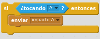
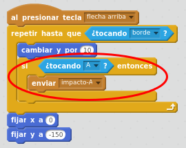
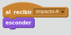
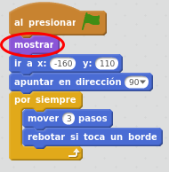
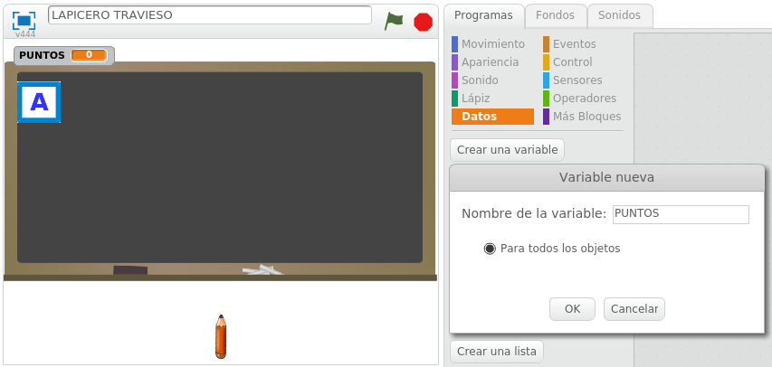
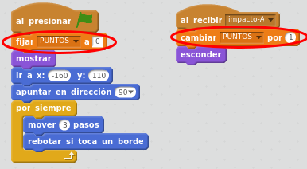

# Colisión del lápiz con la letra

## Caso práctico: detectar colisión con la letra

El objetivo es alcanzar con el lápiz la letra que se mueve.

Para controlar la colisión seguimos añadiendo bloques en la programación del objeto lápiz, en el programa que se inicia "al presionar tecla flecha arriba".

Si detectamos que estamos tocando la letra A, enviaremos el mensaje "impacto-A"  a la letra A para decirle que desaparezca.

Habrá que pensar dónde colocar estos bloques.

%accordion%Solución%accordion%

Estos son los bloques que controlarán que si el lápiz toca el objeto A, entonces se envía el mensaje "impacto-A":

Estos bloques los colocaremos justo después de haber movido el lápiz en 10 posiciones hacia arriba:

%/accordion%

Ahora tenemos que recoger el mensaje "impacto-A" en el objeto A. Por lo tanto, haremos clic en el objeto A para modificar los bloques de su programación.

Añadiremos un bloque de programación en el objeto A: Cuando se reciba el mensaje "impacto-A", haremos que el objeto A desaparezca.

%accordion%Solución%accordion%

%/accordion%

Ahora, cuando el objeto A es impactada por el lápiz, desaparece y ya no vuelve a aparecer. Tendremos que hacer que al inicio del juego, el objeto A aparezca visible. Lo podremos añadir en el programa ya existente que mueve la letra A.

%accordion%Solución%accordion%

%/accordion%

## Caso práctico: Añadir puntuación

Añadiremos un marcador de puntos al juego. Haremos que los puntos se incrementen al detectar la colisión del lápiz con la letra.

Crear una variable llamada PUNTOS.

%accordion%Solución%accordion%

%/accordion%

En la programación del objeto A:

- Al inicio del programa, ponemos los puntos a 0.
- En el momento de detectar colisión, sumamos 1 en la variable puntos.

%accordion%Solución%accordion%

%/accordion%