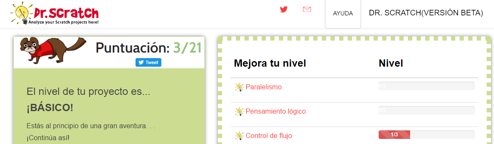

# Evaluar

Para evaluar un proyecto con Scratch podemos hacer una rúbrica más o menos elaborada como en [este proyecto de música](http://eduteka.icesi.edu.co/proyectos.php/2/6548), pero implica un esfuerzo considerable. Proponemos:

## Dr Scratch [http://www.drscratch.org/](http://www.drscratch.org/)

Es una forma objetiva, rápido aunque sólo evalúa el aspecto informático de programación, no los conceptos, la imaginación, los sprits y escenarios creados... 

Podemos ingresar el proyecto mediante la URL (perfecto si utilizamos Scratch online) o por archivo (si utilizamos Scratch offline)

Evalúa del 0-3 estos items:
Paralelismo, Pensamiento lógico, Control de flujo, Interactividad con el usuario, Representación de la información, Abstracción
, Sincronización

En total del 0 al 21, incluso da una realimentación de mejoras

Si nos registramos, graba un historial de logros.

### Un ejemplo:

Si evaluamos este proyecto [https://scratch.mit.edu/projects/123355627/](https://scratch.mit.edu/projects/123355627/)

<iframe width="485" height="402" allowtransparency="true" src="//scratch.mit.edu/projects/embed/123355627/?autostart=false" frameborder="0" allowfullscreen=""></iframe>

Si realizanos la evaluación en [Dr Scratch:](http://drscratch.programamos.es/) pues nos sale ...  oh cielos !!! que malo que soy !!! por favor que esto no se publique !!!

Y encima da opción a descargarte un certificado en PDF  ¡qué vergüenza !

.edu-projects-123355627-_-_PDF-XChange_Viewer.png)
