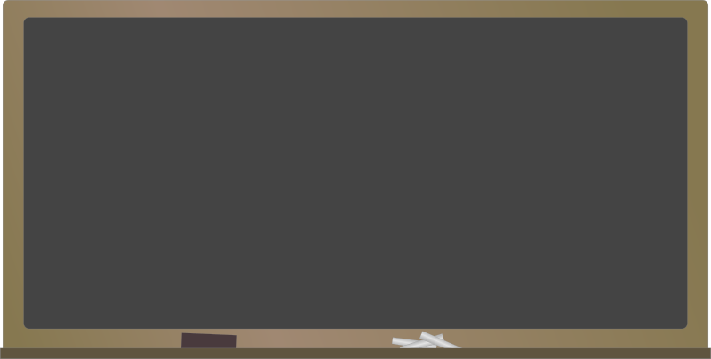

# La idea del juego

Vamos a programar un juego con Scratch.

**La idea de este juego es lanzar un lapicero contra una letra con el objetivo de acertar a darle. La letra se moverá para evitar ser alcanzada. Cuando lo consigamos, la letra desaparecerá, y sumaremos la puntuación de 1 punto.**

Empezaremos montando los objetos que participarán en nuestro juego. Scratch tiene en su biblioteca de imágenes: letras y un lapicero. Con estas imágenes ya tenemos lo necesario para montar nuestros objetos.

Sin embargo, con idea de hacer el juego algo más original, podemos coger dibujos de Internet para montar el juego, o incluso crear con alguna herramienta de dibujo nuestros propios objetos. Para el juego que vamos a trabajar, vamos a utilizar los siguientes dibujos.
**Descárgatelos a tu ordenador (botón derecho - guardar imagen como) porque vamos a montar el juego con ellos.**

 Creación propia, utilizando un editor de textos (OpenOffice Writer), simplemente añadiendo un rectángulo y una letra dentro, y luego capturando la pantalla.

  Fuente: https://openclipart.org/detail/29133/pencil El lapicero está rotado con Gimp. 

Fuente: https://openclipart.org/detail/49363/blackboard 

## Caso práctico: Incluir los objetos de nuestro juego

Empezamos a montar el entorno de objetos de nuestro juego.

Añade la letra A y el lápiz como objetos de Scratch. Revisa que el nombre del objeto A se llame A (botón dcho sobre el objeto - info) porque lo usaremos posteriormente.

Añade la pizarra como fondo.

Ponle un nombre al proyecto: LAPICERO PUNTERO

%accordion%Solución%accordion%

%/accordion%