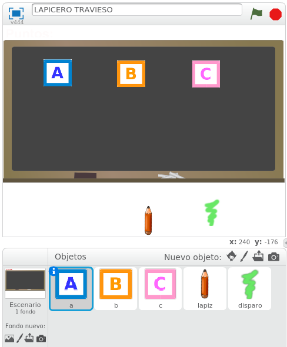

# La idea del juego ampliada

Vamos a programar un nuevo juego con Scratch, que va a ser una ampliación del anterior. La idea de este juego es la del típico matamarcianos. Pero en nuestro caso, lo que vamos a hacer es disparar pintura con un lápiz a unas letras. Las letras se moverán para evitar ser alcanzadas. El objetivo final será acertar a disparar a todas las letras.

Empezaremos montando los objetos que participarán en nuestro juego. Scratch tiene en su biblioteca de imágenes: letras, lapicero, rayo. Con estas tres imágenes ya tenemos lo necesario para montar nuestros objetos.

Sin embargo, con idea de hacer el juego algo más original, podemos coger dibujos de Internet para montar el juego, o incluso crear con alguna herramienta de dibujo nuestros propios objetos. Para el juego que vamos a trabajar, vamos a utilizar los siguientes dibujos. Descárgatelos a tu ordenador (botón derecho - guardar imagen como) porque vamos a montar el juego con ellos.

## Caso práctico: incluir los objetos de nuestro juego

Empezamos a montar el entorno de objetos de nuestro juego.

Añade las letras A, B y C, el lápiz y el disparo como objetos de Scratch. Revisa que los nombres de objetos de las letras A, B y C se llamen a, b, y c, (botón dcho sobre el objeto - info) porque usaremos estos nombres posteriormente.

Añade la pizarra como fondo. 

Ponle un nombre al proyecto: LAPICERO TRAVIESO

<input type="button" name="toggle-feedback-quesFeedback0b158" value="Mostrar retroalimentación" class="feedbackbutton" onclick="$exe.toggleFeedback(this,true);return false" />

### Retroalimentación

