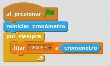
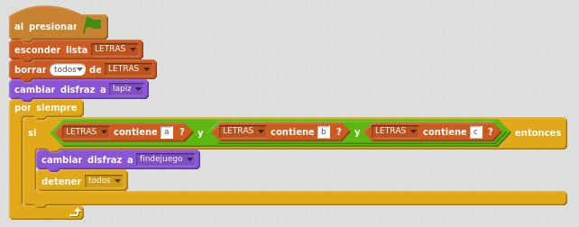

# Últimos ajustes

## Caso práctico: Programar las letras B y C

Ahora hay que programar las letras B y C igual que la A para que tenga el mismo comportamiento. Su programación será prácticamente igual a la del objeto A, cambiando el nombre del mensaje y sus coordenadas.

- Para no empezar de cero, es posible arrastrar todos los bloques de programación de la A sobre el objeto B.
<li>Posteriormente, hay que cambiar datos específicos para objeto B:
<ul>
- El mensaje será "impacto-B"
- Las coordenadas iniciales para B serán x=0 y=110

De igual forma a lo realizado en la letra B, replicamos la programación para el objeto C.

- Su mensaje será "impacto-C"
- La posición fija del objeto C puede ser x=160 y=110

<input type="button" name="toggle-feedback-quesFeedback0b164" value="Mostrar retroalimentación" class="feedbackbutton" onclick="$exe.toggleFeedback(this,true);return false" />

### Retroalimentación

**OTRA OPCIÓN: **Podríamos duplicar el objeto A. Posteriormente habría que:

- Añadirle el disfraz de letra B
- Borrarle al objeto el disfraz de letra A.
- Cambiarle el nombre al objeto por "A" (Botón dcho del ratón sobre el objeto B - info)
- Cambiar los datos especiíficos del objeto B (mensaje "impacto-B", coordenadas -30, 110), y no olvidar añadir la comprobación de colisión en la programación del disparo.

## Caso práctico: Añadir un temporizador

Añadamos un temporizador a nuestro juego.

Crear una variable llamada TIEMPO.

En la programación del Fondo (los fondos también pueden tener sus propios programas), incluiremos un nuevo programa. Al inicio reiniciaremos el cronómetro. En un bucle que se ejecutará siempre, pondremos el valor del cronómetro en la variable TIEMPO y así se visualizará en pantalla.

<input type="button" name="toggle-feedback-quesFeedback0b165" value="Mostrar retroalimentación" class="feedbackbutton" onclick="$exe.toggleFeedback(this,true);return false" />

### Retroalimentación

## Caso práctico: último reto, controlar el fin de juego

Cuando hayamos impactado con todas las letras, mostrar un mensaje en pantalla informando de "Fin de juego".

Una opción sería controlar constantemente el valor de los puntos, y hacer que cuando lleguen a 3, se acabe el juego. Pero otra posible solución algo mejor pensada puede ser controlar en una lista las letras que han sido impactadas. Para ello:

En la programación del lapicero, añadir un nuevo programa, que al iniciar el juego esté comprobando constantemente si hemos impactado las tres letras, y en tal caso mostraremos el mensaje "Fin de juego". Cómo podemos hacerlo:

- Añadiremos un disfraz nuevo al objeto lapiz. Construimos nosotros mismos el disfraz que va a ser el texto "Fin de juego".
- Crear una lista (pestaña Programas - Datos - Crear una lista, que podemos llamar LETRAS).
- Añadimos un bloque de programa en el objeto lapiz, que se inicie al presionar Bandera, donde de forma indefinida comprobaremos si  la lista de letras contiene "a", "b" y "c". En tal caso, cambiaremos el disfraz del lapiz por el disfraz de "findejuego" y detendremos todos los programas.
- Tendremos que hacer que al inicio del juego, el disfraz del lapiz sea el del lapicero, para que no se quede fijo el mensaje de "Fin de juego". Y también habrá que ocultar y vaciar la lista.

En cada objeto de letra: añadir un valor a la lista cada vez que se impacte una letra.

En el objeto de lapiz: Crear una lista. Ocultarla y vaciarla al inicio del juego. 

<input type="button" name="toggle-feedback-quesFeedback0b166" value="Mostrar retroalimentación" class="feedbackbutton" onclick="$exe.toggleFeedback(this,true);return false" />

### Retroalimentación

Crear una lista (pestaña Programas - Datos) y la llamamos LETRAS.

En la programación de las letras, añadir este bloque tras recibir el mensaje de impacto:

El programa del lápiz para controlar el fin de juego quedaría así:

