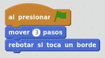
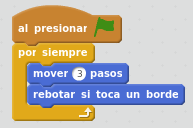
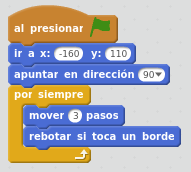

# Movimiento de la letra

## Caso práctico: La letra se mueve sola

Vamos a hacer que la letra A se mueva. La letra A debe moverse de izquierda a derecha cambiando de dirección cuando llegue al borde.

Lo primero de todo: haz clic en el objeto de la letra A, para añadir su programa de bloques.

Empezaremos a arrancar las acciones al presionar Bandera (bloque Eventos: "al presionar bandera"). Haremos que se mueva 3 pasos (bloque Movimiento: "mover 3 pasos"). Cuando llegue al borde de la pantalla, haremos que cambie de dirección (bloque Movimiento: "rebotar si toca un borde").

%accordion%Solución%accordion%

Empezamos a construir la solución. Empezamos poniendo estos bloques:

%accordion%

Al arrancar el programa haciendo clic en la Bandera, veremos que la letra A se mueve 3 pasos a la derecha, pero sólo se mueve una vez. 

Por lo tanto, a los bloques que ya tenemos hay que **añadirles** un bloque de Control: "por siempre", y meter ahí dentro el movimiento y control de rebote. Esto genera un bucle, de forma que la letra A no deje de moverse nunca.

%accordion%Solución%accordion%

Siguente paso: a los bloques que ya tenemos, les metemos el bloque "por siempre", y el programa quedará de la siguiente forma:

%accordion%

Para asegurarnos que la letra A está posicionada siempre en la misma posición al iniciar el juego, ponemos su posición fija al inicio, por ejemplo con con x=-160 y=110 (bloque Movimiento: "ir a x: -160 y: 110").

Hacemos que A apunte a la derecha para que empiece a moverse hacia la derecha (bloque Movimiento: "apuntar en direccion 90"). Es posible que el programa funcione bien incluso sin este bloque, pero así nos aseguramos que la letra se va a empezar a mover hacia la derecha y no hacia otro lado.

%accordion%Solución%accordion%

Con esto ya hemos terminado el PROGRAMA que hace que la letra se mueva sola, y siempre empiece desde la misma posición.

%accordion%