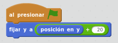
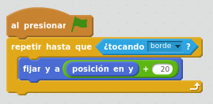
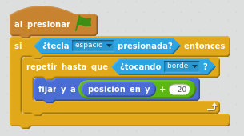
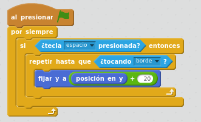
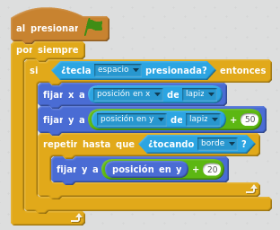
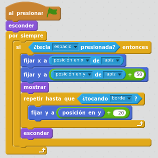

# Movimiento del disparo

## Caso práctico: disparar al presionar espacio

Vamos a hacer que cuando se presione la tecla espacio, el disparo de pintura salga del lápiz y empiece a moverse hacia arriba hasta que llegue al borde superior.

Empezamos haciendo que el disparo se mueva en 20 pasos hacia arriba: Fijaremos la posición Y del objeto disparo sumándole 20 a su posición actual. Utilizaremos el bloque de Operadores " + "

<input type="button" name="toggle-feedback-quesFeedback0b161" value="Mostrar retroalimentación" class="feedbackbutton" onclick="$exe.toggleFeedback(this,true);return false" />

### Retroalimentación

Ahora, el disparo tiene que moverse 20 pasos hacia arriba pero constantemente, hasta que llegue al borde.

<input type="button" name="toggle-feedback-quesFeedback1b161" value="Mostrar retroalimentación" class="feedbackbutton" onclick="$exe.toggleFeedback(this,true);return false" />

### Retroalimentación

Ponemos como condición previa a todo esto que se ponga en marcha si se ha presionado la tecla espacio.

<input type="button" name="toggle-feedback-quesFeedback2b161" value="Mostrar retroalimentación" class="feedbackbutton" onclick="$exe.toggleFeedback(this,true);return false" />

### Retroalimentación

Esto sólo se arranca una vez, necesitamos meter un bucle para que el programa esté constantemente comprobando si se ha presionado la tecla espacio:

El disparo debe salir del lápiz, por tanto, debemos posicionar el disparo encima del lapicero. posicionaremos el disparo 50 pixeles por encima de la posición del lápiz. ¿En qué momento hay que posicionarlo?: antes del bucle que mueve el disparo hacia arriba.

<input type="button" name="toggle-feedback-quesFeedback3b161" value="Mostrar retroalimentación" class="feedbackbutton" onclick="$exe.toggleFeedback(this,true);return false" />

### Retroalimentación

¿Cuándo mostrar y ocultar el disparo?

- Al principio del todo, debemos ocultar el disparo.
- Una vez que tenemos el disparo posicionado encima del lapicero, lo mostramos
- En última instancia, hacemos que desaparezca después de detectar que ha tocado el borde.

<input type="button" name="toggle-feedback-quesFeedback4b161" value="Mostrar retroalimentación" class="feedbackbutton" onclick="$exe.toggleFeedback(this,true);return false" />

### Retroalimentación

