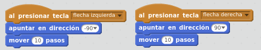
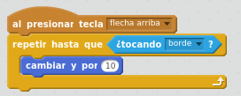
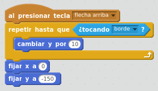

# Movimiento del lápiz

## Caso práctico: mover el lápiz

Haremos que el lápiz se mueva a izquierda y derecha al presionar flechas izquierda y derecha.

%accordion%Solución%accordion%

%/accordion%

## Caso práctico: lanzar el lápiz

Al presionar Flecha arriba, haremos que el lápiz se mueva constantemente hacia arriba, hasta llegar al borde de arriba.

- Iniciamos el programa con el bloque de Control "al presionar tecla flecha arriba".
- Utilizar el bloque Movimiento "cambiar y por 10" para hacer que el lápiz se mueva hacia arriba.
- Añadir el bloque de Control "repetir hasta que &lt; &gt;" para hacer que el bucle se repita constantemente, y que se salga del bucle al llegar a una condición. Habrá que meter el bloque de Movimiento dentro del bucle.
- Utilizar el bloque Sensor "tocando.. borde" para detectar que hemos llegado hasta arriba. Esta será la condición de salida del bucle.

%accordion%Solución%accordion%

%/accordion%

Cuando llegue el lápiz arriba del todo, es decir: cuando se termine el bucle que comprueba si el lápiz ha tocado un borde, lo volvemos a poner en su situación inicial.

%accordion%Solución%accordion%

%/accordion%