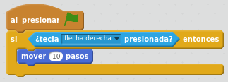
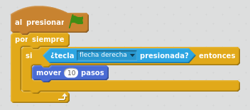
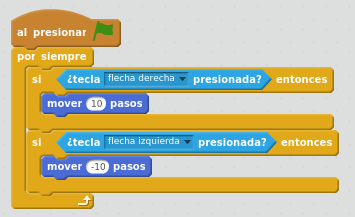

# Movimiento del lápiz

## Caso práctico: el lápiz se mueve con las teclas izquierda y derecha

Queremos que el lápiz se mueva a la izquierda cuando presionemos la flecha izquierda. Y que se mueva a la derecha cuando presionemos la flecha derecha.

Esto ya lo hemos hecho en el juego anterior. Sin embargo, si somos "exquisitos", habrás observado que si mantienes pulsada una tecla de flecha izquierda o derecha, debido a que hay un retardo en el teclado antes de empezar a mandar la señal de repetición a nuestro programa, se produce también un retardo en el primer movimiento del lápiz. 

Vamos a construir una solución que evita este inconveniente con la siguiente lógica: Al presionar Bandera, estaremos comprobando de forma indefinida si hay alguna tecla presionada. Moveremos el lápiz 10 pasos a la derecha si se presiona la tecla "flecha derecha", y moveremos el lápiz 10 pasos a la izquierda si se presiona la tecla "flecha izquierda".

Empezamos a construir la solución paso a paso. En primer lugar, vamos a hacer que al presionar Bandera, haremos que si la tecla "flecha derecha" está presionada, mover el lápiz 10 pasos a la derecha

<input type="button" name="toggle-feedback-quesFeedback0b160" value="Mostrar retroalimentación" class="feedbackbutton" onclick="$exe.toggleFeedback(this,true);return false" />

### Retroalimentación

Pero esto no funciona. porque estos bloques sólo se arrancan una vez. Y necesitamos que el programa esté constantemente comprobando si la tecla está presionada. Por lo tanto, tenemos que poner todo dentro el bloque de Control "por siempre", para que el programa esté constantemente comprobando si la tecla está presionada. Ahora ya habremos conseguido que el lápiz se mueva a la derecha cuando presionemos la tecla de flecha derecha,

<input type="button" name="toggle-feedback-quesFeedback1b160" value="Mostrar retroalimentación" class="feedbackbutton" onclick="$exe.toggleFeedback(this,true);return false" />

### Retroalimentación

Lo único que queda es añadir la comprobación de si la tecla de flecha izquierda esté presionada, se mueva el lápiz 10 pasos a la izquierda. 

<input type="button" name="toggle-feedback-quesFeedback2b160" value="Mostrar retroalimentación" class="feedbackbutton" onclick="$exe.toggleFeedback(this,true);return false" />

### Retroalimentación

