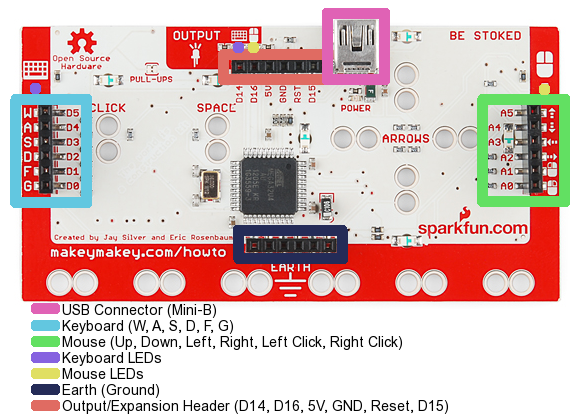

# Piano

## Propuesta

Hacer un piano humano

https//www.youtube.com/watch?v=928P7-xr6OY

%accordion%Solución%accordion%

Primero tenemos que definir qué teclas son qué notas, nuestra propuesta es la siguiente:

|Tecla|Nota|
|--|--|
|Flecha izq|48
|Flecha abajo|50
|Flecha arriba|52
|Flecha der|53
|w|55
|a|57
|s|59
|d|60

El programa en sí es muy básico:

Puedes probarlo aquí pero utilizando las teclas del teclado y del ratón

<iframe width="485" height="402" allowtransparency="true" src="//scratch.mit.edu/projects/embed/123624393/?autostart=false" frameborder="0" allowfullscreen=""></iframe>

La única dificultad es la construcción: Cada tecla del Makey Makey se conecta con un cable, y al otro extremo una persona que hace de esa tecla.

El que toca el piano tiene que estar conectado a la masa del Makey Makey con un cable

Es muy aparatoso, lo probamos en un seminario de asesores TIC y quedó de cine !

## ALTERNATIVAS

Con bananas, plastilina, gominolas....

https//www.youtube.com/watch?v=wkPt9MYqDW0

%/accordion%

