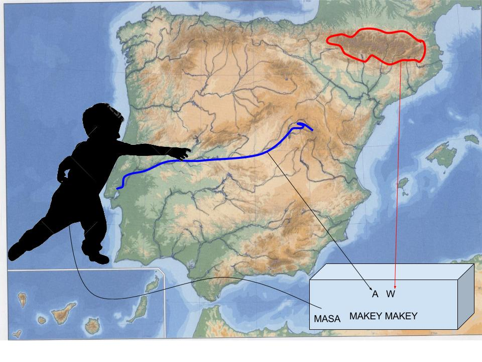

# Plastilina II

## Propuesta

Hacer un mapa de relieve interactivo con plastilina

Por ejemplo: Ponemos el mapa físico de la península y plastilina conductora:

- Una plastilina en **Pirineos** lo conectamos al **W** del Makey Makey
- Otra plastilina en el rio Tajo lo conectamos al **A** del Makey Makey
- el niño tiene que tocar la masa del Makey Makey

Hacer un programa en Scratch que vaya preguntando y si contestas bien que salga aplausos y un texto "bien" en caso contrario un sonido de fallo y el mensaje "No no"

%accordion%Solución%accordion%

Este es el proyecto:[ ](https://scratch.mit.edu/projects/124217131/)[https://scratch.mit.edu/projects/124217131/](https://scratch.mit.edu/projects/124217131/)

si no tienes el Makey Makey no pasa nada, pulsa con el teclado A y W y a jugar !!!

<iframe width="485" height="402" allowtransparency="true" src="//scratch.mit.edu/projects/embed/124217131/?autostart=false" frameborder="0" allowfullscreen=""></iframe>

%accordion%