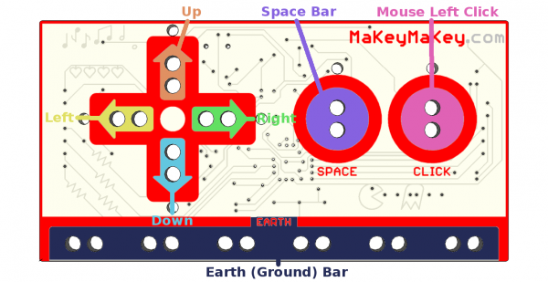
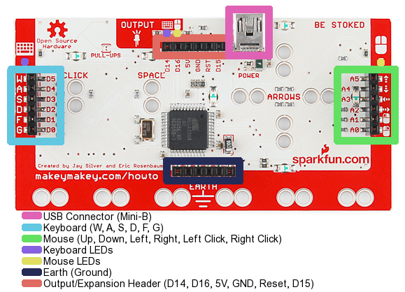

# ¿Qué es?

Es simplemente una entrada al ordenador por USB, como un teclado o ratón, pero por contacto:

https//www.youtube.com/watch?v=rfQqh7iCcOU
Las entradas principales son las flechas del teclado, la barra espaciadora y el click del ratón

Debajo de la placa tiene acceso a  

- las teclas **W, A, S, D, F, **y** G **
- **botón derecho, izquierdo del ratón** y sus **movimientos**

Se pueden alterar estos parámetros entrando en su código y modificandolo `[[+info](https://learn.sparkfun.com/tutorials/makey-makey-advanced-guide)]

Cuesta alrededor de [70€](http://www.amazon.es/Sparkfun-Makey-Deluxe-Kit/dp/B00PIRTDKS/ref=sr_1_2?s=electronics&amp;ie=UTF8&amp;qid=1421217751&amp;sr=1-2&amp;keywords=makey+makey)

