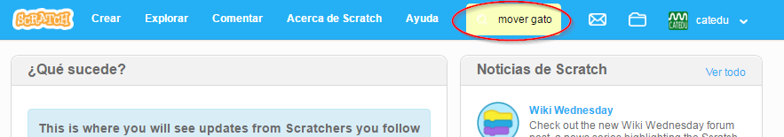
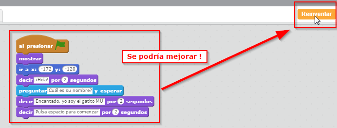
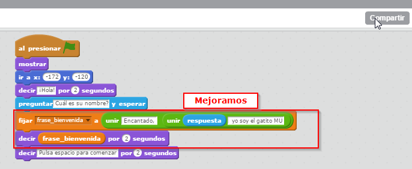
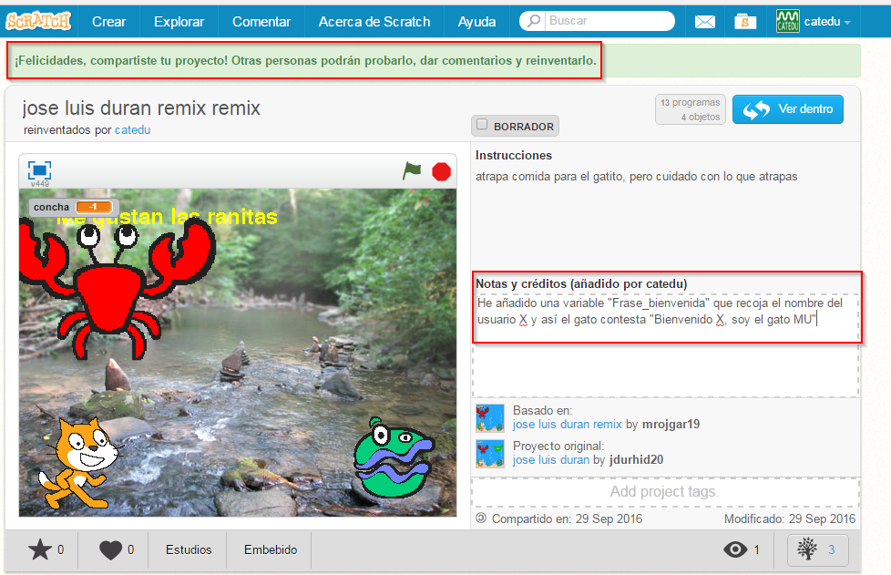
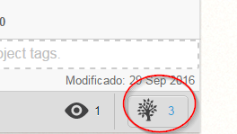
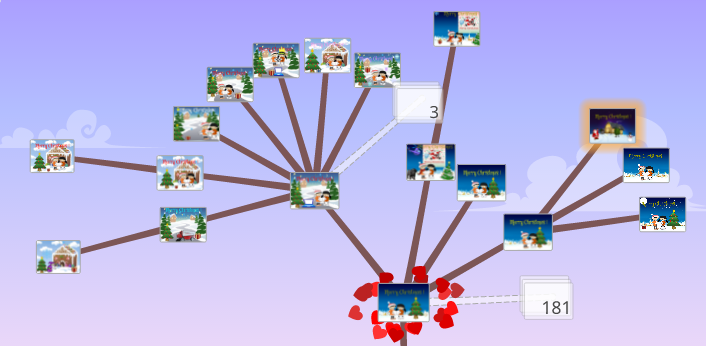

# Reinventar

Buscamos un programa que esté relacionado con el movimiento del sprit, por ejemplo:

y encontramos este [https://scratch.mit.edu/projects/38947928/](https://scratch.mit.edu/projects/38947928/):

<iframe width="485" height="402" allowtransparency="true" src="//scratch.mit.edu/projects/embed/38947928/?autostart=false" frameborder="0" allowfullscreen=""></iframe>

Nos gusta pero vemos que se podría mejorar:

Mejoramos el código, añadiendo una variable "frase_bienvenida" que recoja la respuesta y el texto que queremos que aparezca

Le damos a compartir y nos sale un mensaje de bienvenida y la opción de describir nuestra mejora:

y ahora es otro proyecto: [https://scratch.mit.edu/projects/123302249/](https://scratch.mit.edu/projects/123302249/)

<iframe width="485" height="402" allowtransparency="true" src="//scratch.mit.edu/projects/embed/123302249/?autostart=false" frameborder="0" allowfullscreen=""></iframe>

Si pinchamos en el árbol sale [esta página](https://scratch.mit.edu/projects/123302249/remixtree/) y aparece 3 reinvenciones (a fecha 29/9/16) el primero es el original, uno segundo (del mismo autor que lo mejoró) y esta última de Catedu 

Hay proyectos donde las reinvenciones son muchas y salen muchas versiones de la misma, por ejemplo [en este proyecto ](https://scratch.mit.edu/projects/14873961/)de tarjetas navideñas[ el árbol de reinvenciones](https://scratch.mit.edu/projects/14873961/remixtree/)

