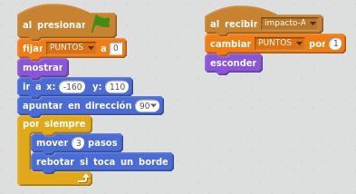
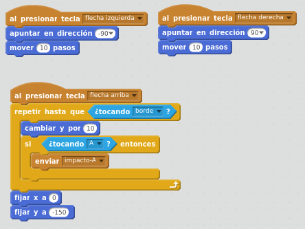

# Resultado final

Hasta aquí, hemos creado una programación para el juego de lanzar un lápiz contra una letra. 

Los programas del objeto A queda por tanto de la siguiente forma:

Los programas del objeto lapiz quedan por tanto de la siguiente forma:

**¡YA LO TENEMOS!. Utilizando Pensamiento Computacional, hemos conseguido montar un pequeño juego con Scratch.**

