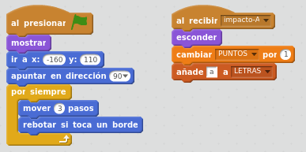
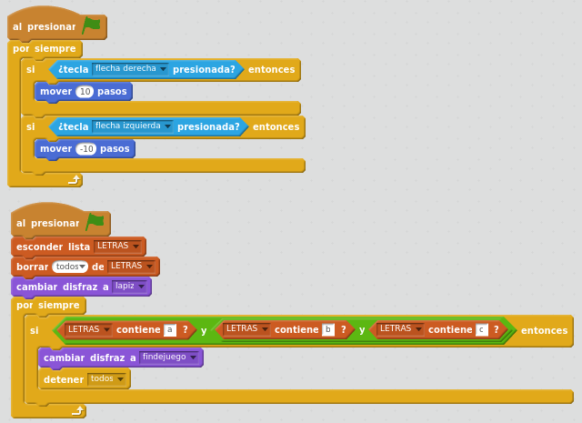
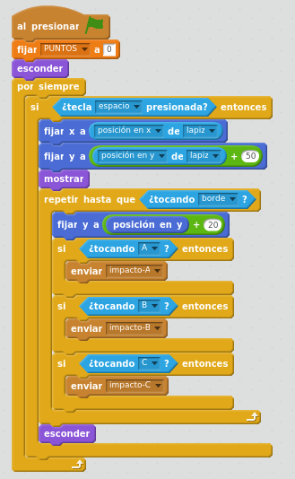
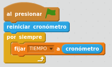

# Resultado final

Hemos creado una programación para el juego de lanzar pintura desde un lápiz contra varias letras. 

Los programas de cada letra, por ejemplo de la letra A, quedan de la siguiente forma:

Los programas del lápiz quedan:

El programa del disparo queda:

El programa de la imagen de fondo queda:

**¡YA LO TENEMOS!. Utilizando Pensamiento Computacional, hemos conseguido montar un juego completo con Scratch.**

[**Ver resultado final**](https://scratch.mit.edu/projects/125282917/)

** <iframe width="485" height="402" allowtransparency="true" src="//scratch.mit.edu/projects/embed/125282917/?autostart=false" frameborder="0" allowfullscreen=""></iframe> **

